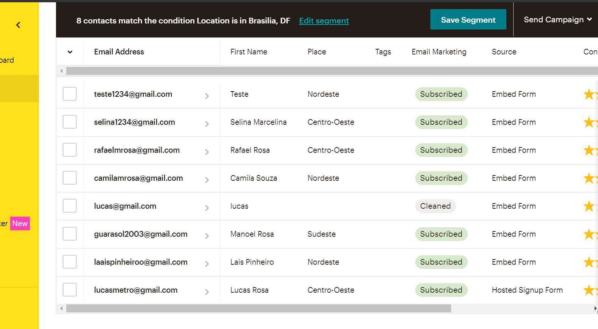

# TelaDeCaptura

### - Este projeto foi feito para pessoas que precisam capturar informações de interessados pelo seu produto, para obter uma lista de contatos para envio de e-mail em massa. Desta forma, será possivel capturar dados como: nome, e-mail, telefone, endereço e etc. 

### - Nesta aplicação foram usados as seguintes tecnologias:

#### *HTML.
#### *CSS.
#### *Serviço de back end do mailchimp.

### Vejo o projeto você mesmo! Acesse: https://romantic-keller-42e920.netlify.app/

### Gostou do meu projeto? :D Entre em contato comigo! 
[Linkedin](https://www.linkedin.com/in/lucas-rosa-058683102/)  
[Email: lucasmetron@gmail.com](mailto:lucasmetron@gmail.com)

